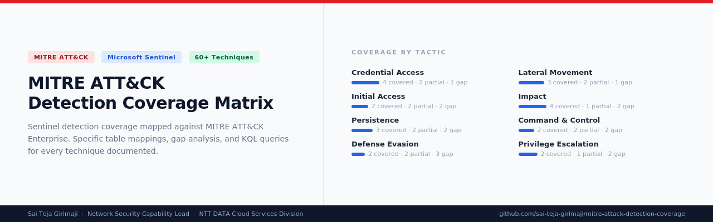

# MITRE ATT&CK Detection Coverage Matrix

> Microsoft Sentinel detection coverage mapped against MITRE ATT&CK Enterprise, with data source requirements, gap analysis, and actionable remediation guidance

  
  
  
  

---

## Purpose

Most MITRE ATT&CK coverage matrices tell you which techniques you cover. This one tells you:

- Which Sentinel table detects each technique
- Which connector or audit policy is required
- Whether coverage is complete, partial, or missing
- Exactly what you need to close each gap

This is a practitioner-built reference, not a vendor marketing document. Every mapping references a real Sentinel data source with real detection logic.

---

## Coverage Summary

| Tactic | Techniques Documented | Covered | Partial | Gap |
|---|---|---|---|---|
| [Initial Access](./initial-access.md) | 6 | 2 | 2 | 2 |
| [Execution](./execution.md) | 6 | 2 | 2 | 2 |
| [Persistence](./persistence.md) | 7 | 3 | 2 | 2 |
| [Privilege Escalation](./privilege-escalation.md) | 5 | 2 | 1 | 2 |
| [Defense Evasion](./defense-evasion.md) | 7 | 2 | 2 | 3 |
| [Credential Access](./credential-access.md) | 7 | 4 | 2 | 1 |
| [Discovery](./discovery.md) | 7 | 1 | 3 | 3 |
| [Lateral Movement](./lateral-movement.md) | 6 | 3 | 2 | 1 |
| [Collection](./collection.md) | 5 | 1 | 2 | 2 |
| [Command and Control](./command-and-control.md) | 6 | 2 | 2 | 2 |
| [Exfiltration](./exfiltration.md) | 5 | 1 | 2 | 2 |
| [Impact](./impact.md) | 7 | 4 | 1 | 2 |

---

## Status Key

| Status | Meaning |
|---|---|
| ✅ Covered | Detection rule exists. Sentinel table is connected and query is validated. |
| ⚠️ Partial | Some sub-techniques or scenarios are detectable. Full coverage requires additional configuration. |
| ❌ Gap | Log source is available but no rule has been written. Detectable with effort. |
| 🔴 No Source | Detection requires a log source or connector not available by default. Action required. |

---

## Related Resources

| Resource | Description |
|---|---|
| [Sentinel KQL Detection Rules](https://github.com/sai-teja-girimaji/sentinel-kql-detection-rules) | Production-ready KQL rules referenced throughout this matrix |
| [AI Security Governance Framework](https://github.com/sai-teja-girimaji/ai-security-governance-framework) | Governance standards for AI-assisted SOC deployments |
| [Data Source Requirements](./data-source-requirements.md) | Full connector and audit policy reference for all data sources used in this matrix |

---

## How to Use This Matrix

**For gap analysis:** Start with the Coverage Summary table. Identify which tactics have the most gaps. Open the tactic file and review each gap entry. The gap entry tells you what connector or audit policy is required to achieve coverage.

**For detection engineering:** Use the covered and partial entries as a baseline. For partial entries, the tactic file explains what additional configuration is needed to achieve full coverage.

**For board or leadership reporting:** The Coverage Summary table can be used directly to communicate detection coverage posture. Reference the gap count and the data source requirements to communicate the investment needed to close them.

**For threat hunting:** Use the partial and gap entries to identify technique areas where automated detection is weak and manual hunting is the primary detection mechanism.

---

## Author

**Sai Teja Girimaji**
Network Security Capability Lead, NTT DATA Cloud Services Division

[LinkedIn](https://www.linkedin.com/in/girimaji-saiteja-569b356a) | [Portfolio](https://saiteja-security.netlify.app)

---

*This matrix is maintained against MITRE ATT&CK Enterprise. Coverage status is reviewed quarterly or after significant changes to the Sentinel connector ecosystem.*
